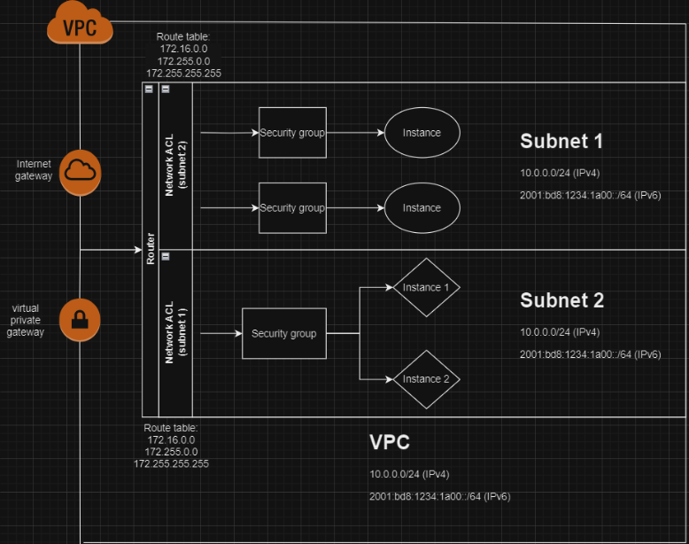

# AWS Cloud Security Project

## Overview
This project demonstrates hands-on implementation of AWS cloud security best practices including IAM, S3, EC2, VPC, CloudWatch, and CloudTrail.

The focus is on enforcing the Principle of Least Privilege (PLP), securing infrastructure, and implementing monitoring and threat detection.

---

## Architecture

---

## Key Components

### EC2 Security
- Linux + Windows instances deployed
- Security groups configured (least privilege)
- Server hardening applied
- Process monitoring (top, Resource Monitor)

➡️ [View EC2 Security Details](ec2-security/ec2-setup.md)

---

### IAM (Identity & Access Management)
- 5 users + 2 groups created
- MFA enforced
- Least privilege policies applied
- Deny EC2 policy implemented

➡️ [View IAM Details](iam-security/iam-setup.md)

---

### S3 Security
- Buckets with fake sensitive data
- Block Public Access enabled
- Bucket policies implemented
- Pre-signed URLs tested

➡️ [View S3 Details](s3-security/s3-config.md)

---

### Monitoring & Logging
- CloudWatch dashboards + billing alarms
- CloudTrail event tracking
- Log analysis (12 unique users identified)

➡️ [View Monitoring](monitoring-logging/cloudwatch.md)

---

### Networking (VPC)
- 2 VPCs with peering
- Private instance (no public access)
- NACLs + routing tables configured

➡️ [View Networking](networking/vpc-peering.md)

---

### AWS Security Services
- Inspector
- GuardDuty
- Macie
- Trusted Advisor
- Access Analyzer
- AWS Config

➡️ [View Evaluation](security-services/aws-security-tools.md)

---

## Key Security Takeaways
- Most AWS risks come from misconfiguration
- Least Privilege is critical
- Monitoring = visibility = security
- S3 + IAM are the biggest attack surfaces

---

## Full Report
For full documentation:

📄 [View Full Report](original-report/AWS_Project.pdf)
